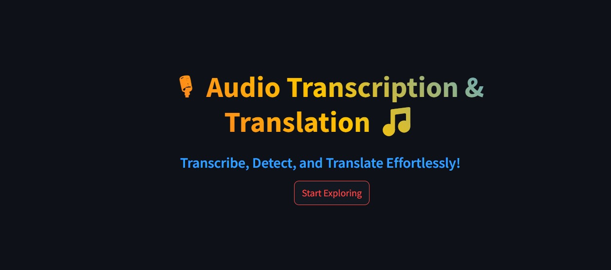
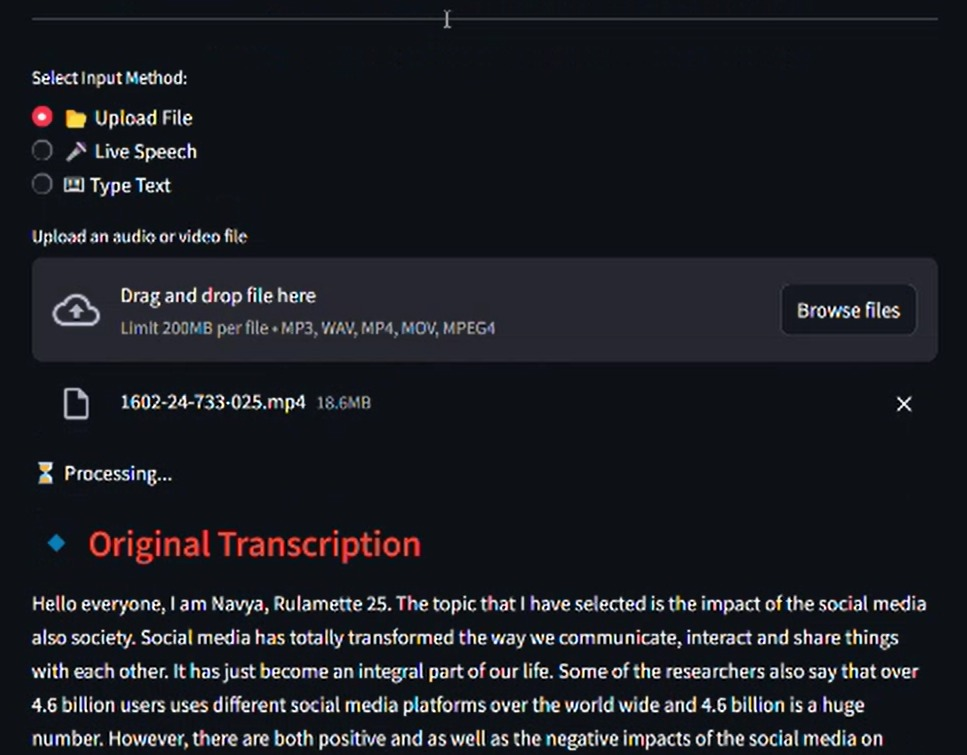
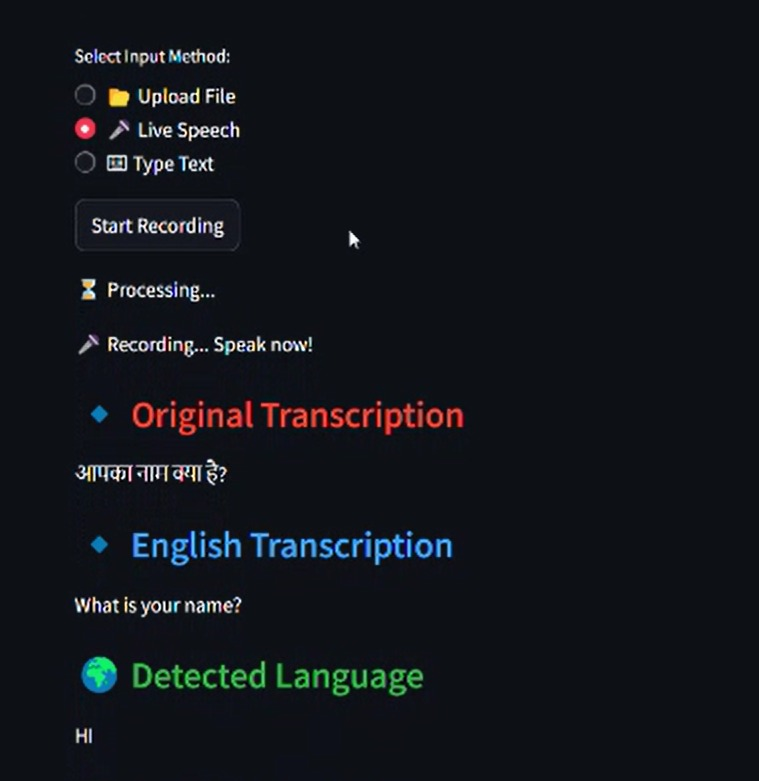
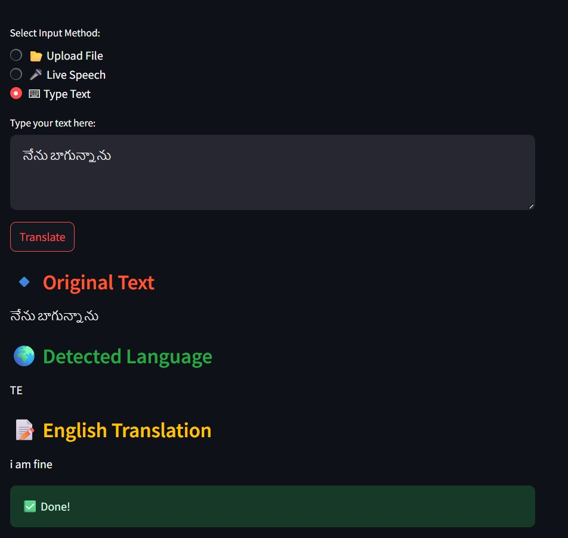

#  AI Audio Transcription & Translation App

An AI-powered web application that performs **speech-to-text transcription and multilingual translation** using a locally deployed Whisper model.

The app supports multiple input modes including **audio/video file upload, live speech recording, and text input**, making it a versatile tool for real-time language processing.

---

##  Features

###  File Upload Transcription
Upload audio or video files (MP3, WAV, MP4, etc.) and get accurate transcription along with translation to English.

###  Live Speech Recognition
Record speech directly through the microphone and convert it into text in real-time.

###  Text Translation
Input text manually and get automatic language detection with English translation.

###  Language Detection
Automatically detects the input language and processes it accordingly.

###  Real-Time Translation
Translates transcribed or input text into English for better accessibility.

###  Interactive UI
User-friendly interface built with Streamlit for smooth interaction and experience.

---

##  Tech Stack

- Python  
- Streamlit  
- Whisper (OpenAI – Local Model)  
- PyAudio  
- NumPy  
- Deep Translator  
- LangDetect  

---

---

## Screenshots

  
  

  
  

---
## Conclusion

This project demonstrates the practical use of AI in solving real-world problems like speech recognition and language translation.  
By integrating multiple input methods and intelligent processing, it provides a flexible and user-friendly solution for seamless communication.
